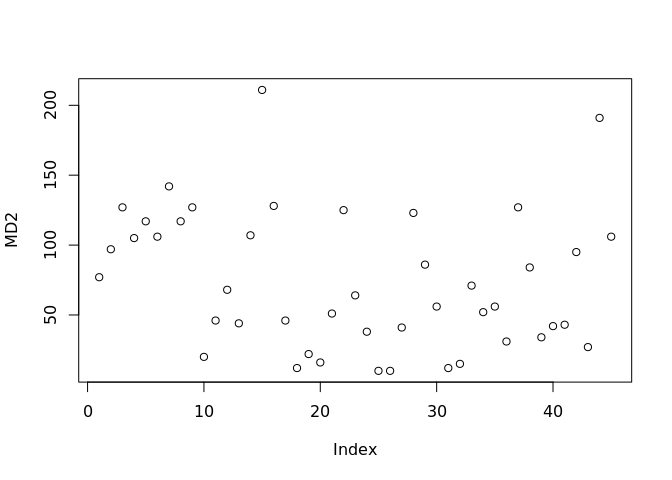
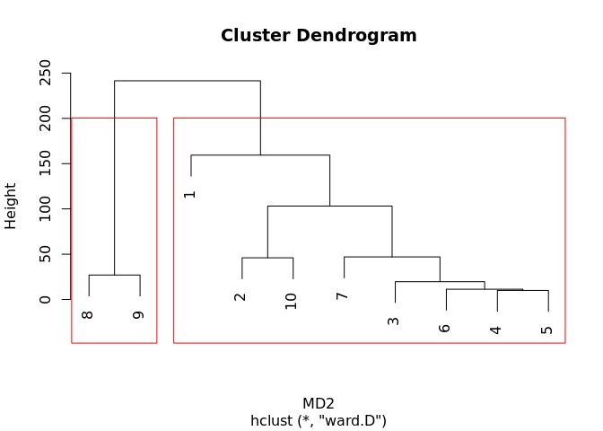
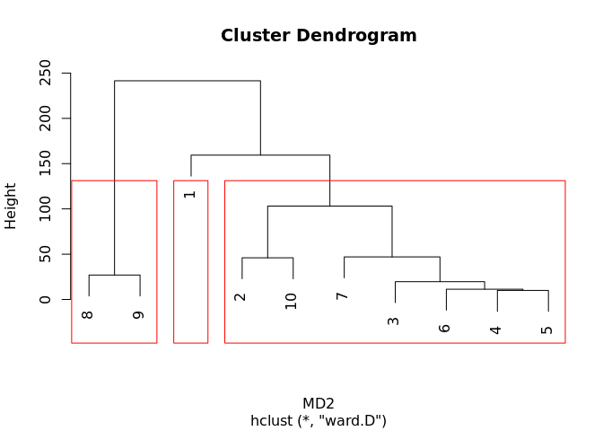
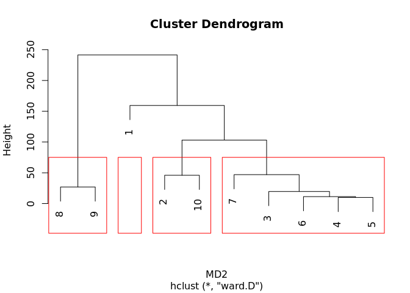
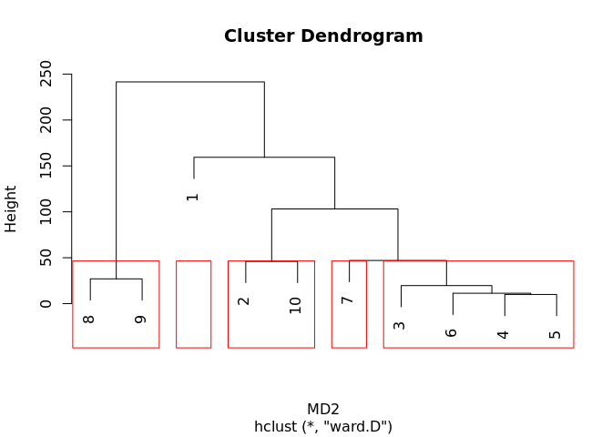

<!-- README.md is generated from README.Rmd. Please edit that file -->

# Clusters_analysis

We have five employees (x1-x5) in an office or branch of our company. A
series of tasks (10 tasks) have been carried out and the time it takes
to complete them in minutes has been noted, from the time they start
until they finish. These tasks refer to the sale of products to a
potential customer from when they offer the product to the customer
until they close the sale.

Which tasks are more effective to sell the product to the customer?

    #>       [,1] [,2] [,3] [,4] [,5]
    #>  [1,]   25   50   60   36   40
    #>  [2,]   26   55   65   35   45
    #>  [3,]   25   58   65   34   42
    #>  [4,]   24   59   64   31   42
    #>  [5,]   23   59   62   32   40
    #>  [6,]   22   59   63   33   43
    #>  [7,]   20   58   62   33   38
    #>  [8,]   22   58   61   34   32
    #>  [9,]   24   59   63   37   35
    #> [10,]   25   60   61   37   45

<!-- -->

    #> 
    #> Call:
    #> hclust(d = MD2, method = "ward.D")
    #> 
    #> Cluster method   : ward.D 
    #> Distance         : euclidean 
    #> Number of objects: 10
    #>  [1] 1 1 1 1 1 1 1 2 2 1

<!-- -->

    #>  [1] 1 2 2 2 2 2 2 3 3 2

<!-- -->

    #>  [1] 1 2 3 3 3 3 3 4 4 2

<!-- -->

    #>  [1] 1 2 3 3 3 3 4 5 5 2

<!-- -->

A complete cluster analysis was carried out, finding out how many
clusters there are previously with the negative distance matrix of the
tasks, obtaining 2 clusters as a result, later we made our Euclidean
method distance matrix and used Ward’s method, and cut to 2 clusters,
finding in the dendrogram that task 1 is a possible anomalous datum due
to the great weight it has and tasks 8-9 also but with little weight,
being then in theory tasks 2, 3, 4, 5, 6, 7, 10 the more effective.

A cluster analysis of the employees was also carried out, obtaining 3
clusters with the matrix of negative distances, and performing the
matrix with the Euclidean method and Ward’s method, we cut 3 clusters,
finding in the dendrogram that employee 1 is detected as an anomalous
data since it has the shortest times per task, and we have groups 2-3
with the highest times per task and 4-5 with intermediate times.
